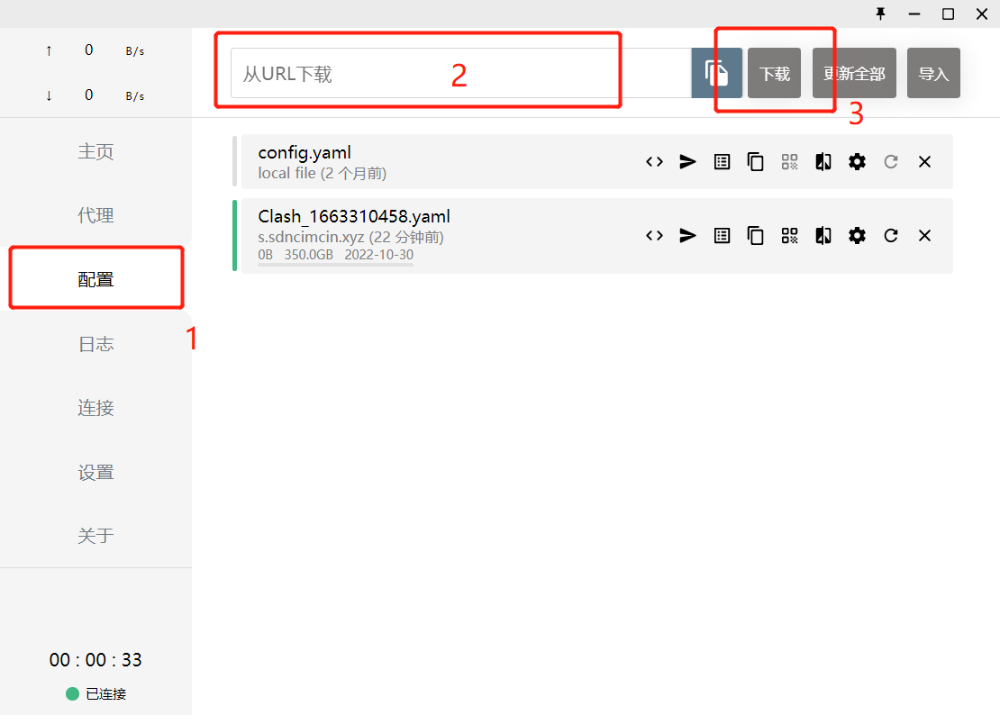
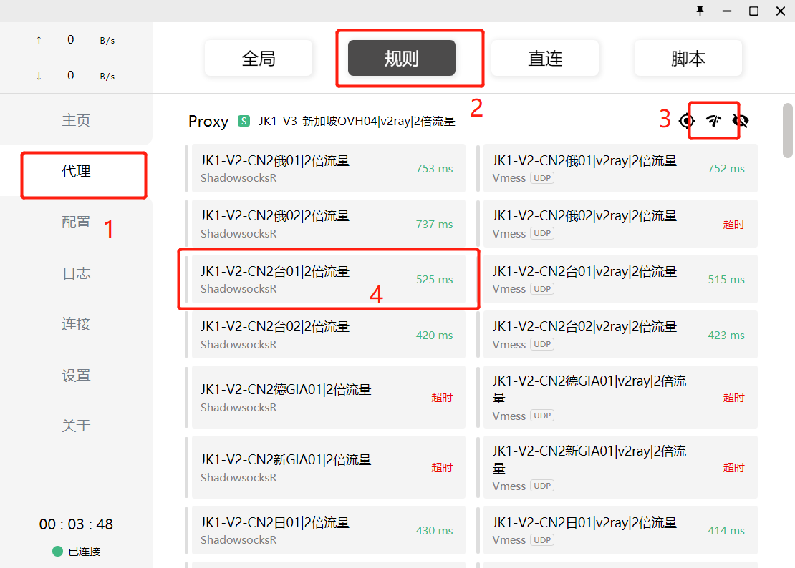
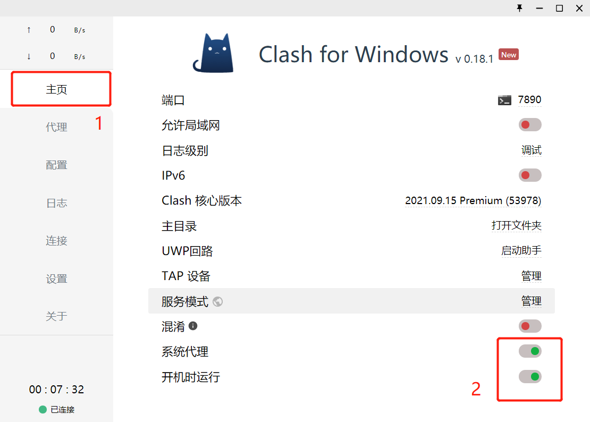

# clash的一次简单的配置

## 写在前面

该教程仅为博主的配置过程，仅供参考。

## 使用环境

- 主机环境：win10
- clash for windows：v0.18.1

## 配置过程

### 第一步

将 `clash` 目录下的安装包解压缩。（提供的是汉化版本）

### 第二步

在`配置`界面中输入自己的 `URL` 订阅记录，随后点击`下载`，出现`成功`字样即可。

### 第三步

在`代理`界面选择`规则`栏，随后进行`节点测速`，选择`不超时且延迟较低的节点`即可。

### 第四步

在`主页`界面将`系统代理`和`开机时运行`打开即可。

### 第五步

你可以去外面看风景了。

## 常见问题

### 校园网连接不上

关闭`系统代理`，再次连接校园网即可。
